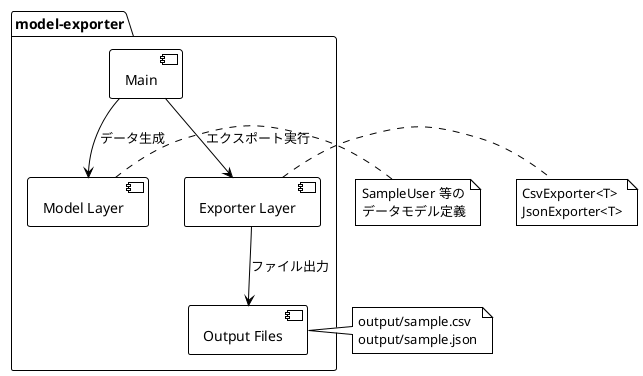

# 基本設計書

## 1. システム概要

### 1.1 目的

model-exporter は、Java アプリケーション内のモデルオブジェクトを CSV および JSON ファイルとして出力するためのユーティリティシステムである。

### 1.2 背景

データのエクスポート処理は多くのアプリケーションで必要とされる共通機能である。本システムは、ジェネリクスを活用した汎用エクスポーターを提供することで、モデルの種類に依存しない再利用可能なエクスポート基盤を実現する。

### 1.3 スコープ

| 範囲 | 内容 |
|------|------|
| 対象 | Java オブジェクトのファイル出力 |
| 出力形式 | CSV, JSON |
| 対象外 | データベース連携、API公開、GUI |

## 2. システム構成図

## 3. 機能一覧

| ID | 機能名 | 概要 | 優先度 |
|----|--------|------|--------|
| F-001 | CSV エクスポート | モデルオブジェクトのリストを CSV ファイルとして出力する | 必須 |
| F-002 | JSON エクスポート | モデルオブジェクトのリストを JSON ファイルとして出力する | 必須 |
| F-003 | 出力ディレクトリ自動作成 | 出力先ディレクトリが存在しない場合に自動作成する | 必須 |
| F-004 | 汎用モデル対応 | ジェネリクスにより任意のモデルクラスに対応する | 必須 |

## 4. 技術スタック

| カテゴリ | 技術 | バージョン | 用途 |
|----------|------|-----------|------|
| 言語 | Java | 11 | アプリケーション開発 |
| ビルドツール | Gradle | 7.2 | ビルド・依存関係管理 |
| CSV処理 | OpenCSV | 5.7.1 | CSV ファイル出力 |
| JSON処理 | Jackson Databind | 2.13.4 | JSON シリアライズ・ファイル出力 |
| ログ出力 | SLF4J + Log4j2 | ※導入予定 | アプリケーションログ管理 |

## 5. 外部インターフェース

### 5.1 入力

| 項目 | 内容 |
|------|------|
| 入力形式 | Java オブジェクトのリスト（`List<T>`） |
| 入力元 | アプリケーション内部で生成 |
| 制約 | CSV 出力にはモデルクラスにデフォルトコンストラクタと `@CsvBindByName` が必要 |

### 5.2 出力

| 項目 | CSV 出力 | JSON 出力 |
|------|---------|-----------|
| ファイル形式 | CSV（カンマ区切り） | JSON（配列形式） |
| 文字コード | UTF-8（システムデフォルト） | UTF-8 |
| 出力先 | 任意のファイルパス | 任意のファイルパス |
| ヘッダー | `@CsvBindByName` の column 値 | なし（キー名はフィールド名） |

## 6. 非機能要件

### 6.1 拡張性

| 要件 | 実現方式 |
|------|---------|
| 新規モデル追加 | ジェネリクス `<T>` により、モデルクラスを追加するだけで対応可能 |
| 新規出力形式追加 | 既存エクスポーターと同様のインターフェースで新クラスを追加 |
| 出力先変更 | ファイルパスを引数として受け取るため、呼び出し側で制御可能 |

### 6.2 保守性

| 要件 | 実現方式 |
|------|---------|
| モジュール分離 | model / exporter / エントリーポイントを明確に分離 |
| テスト容易性 | エクスポーターがジェネリクスのため、テスト用モデルで単体テスト可能 |

### 6.3 ログ出力方針

| 項目 | 方針 |
|------|------|
| ログフレームワーク | SLF4J（ファサード）+ Log4j2（実装） |
| ログレベル運用 | ERROR: 異常終了 / WARN: 継続可能な問題 / INFO: 処理結果 / DEBUG: 詳細トレース |
| 出力先 | コンソール + ログファイル |
| 詳細 | [ログ出力方式検討書](logging-design.md) を参照 |
