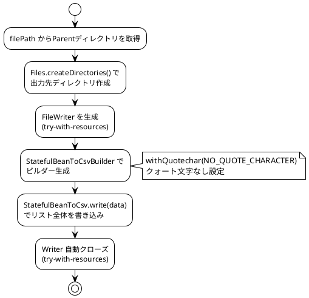
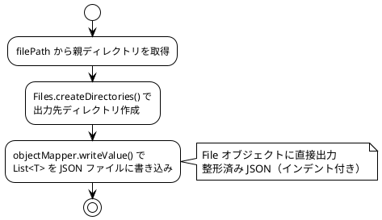
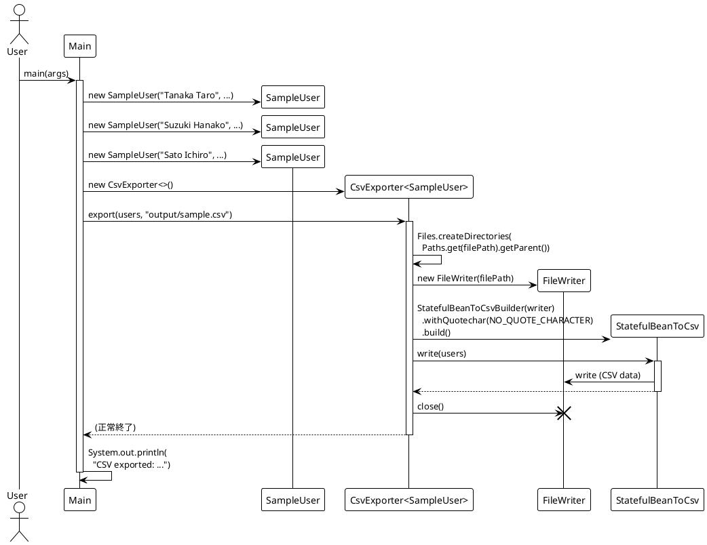
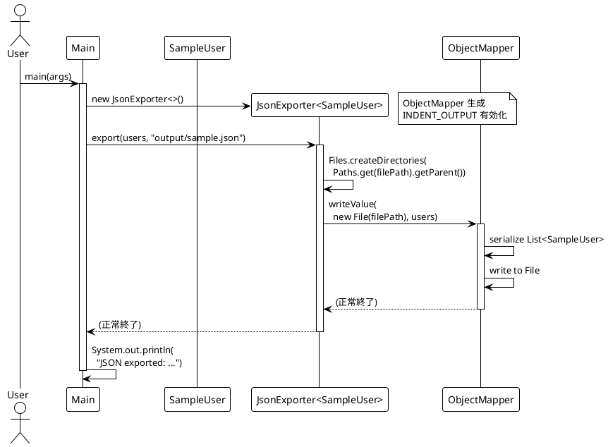
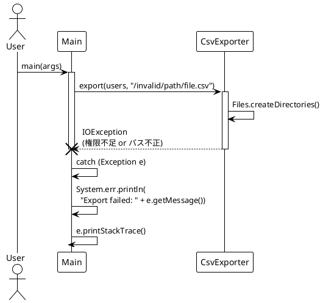
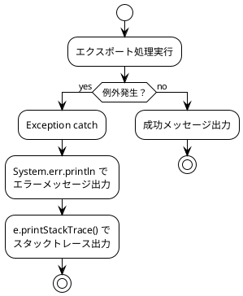

# 詳細設計書

## 1. クラス詳細仕様

### 1.1 Main

| 項目 | 内容 |
|------|------|
| パッケージ | `com.example.exporter` |
| 責務 | アプリケーションのエントリーポイント。サンプルデータの生成とエクスポート実行 |

**定数:**

| 名前 | 型 | 値 | 説明 |
|------|-----|-----|------|
| OUTPUT_CSV | `String` | `"output/sample.csv"` | CSV 出力先パス |
| OUTPUT_JSON | `String` | `"output/sample.json"` | JSON 出力先パス |

**メソッド:**

| メソッド | `main(String[] args)` |
|---------|----------------------|
| 修飾子 | `public static` |
| 戻り値 | `void` |
| 処理概要 | 1. SampleUser のリストを生成 |
| | 2. CsvExporter でCSV出力 |
| | 3. JsonExporter でJSON出力 |
| | 4. 成功メッセージを標準出力 |
| 例外処理 | `Exception` を catch し、エラーメッセージを `System.err` に出力 |

---

### 1.2 SampleUser

| 項目 | 内容 |
|------|------|
| パッケージ | `com.example.exporter.model` |
| 責務 | ユーザー情報を保持するデータモデル |

**フィールド:**

| フィールド | 型 | アノテーション | CSV列名 | 制約 |
|-----------|-----|---------------|---------|------|
| name | `String` | `@CsvBindByName(column = "NAME")` | NAME | なし |
| email | `String` | `@CsvBindByName(column = "EMAIL")` | EMAIL | なし |
| age | `int` | `@CsvBindByName(column = "AGE")` | AGE | なし |

**コンストラクタ:**

| コンストラクタ | 引数 | 用途 |
|---------------|------|------|
| `SampleUser()` | なし | OpenCSV の Bean 生成に必要（リフレクション用） |
| `SampleUser(String, String, int)` | name, email, age | アプリケーションコードからの生成用 |

**メソッド:** 各フィールドに対する getter / setter（標準 JavaBean パターン）

---

### 1.3 CsvExporter\<T\>

| 項目 | 内容 |
|------|------|
| パッケージ | `com.example.exporter.exporter` |
| 責務 | 任意のモデルオブジェクトのリストを CSV ファイルとして出力 |
| 型パラメータ | `T` — CSV出力対象のモデルクラス。`@CsvBindByName` 付きフィールドが必要 |

**メソッド:**

| メソッド | `export(List<T> data, String filePath)` |
|---------|----------------------------------------|
| 修飾子 | `public` |
| 戻り値 | `void` |
| 例外 | `Exception`（IOException, CsvDataTypeMismatchException 等） |

**処理フロー:**



**使用ライブラリ詳細:**

| クラス | 役割 |
|--------|------|
| `StatefulBeanToCsvBuilder<T>` | CSV Writer のビルダー。設定を構成する |
| `StatefulBeanToCsv<T>` | Bean → CSV 変換・書き込みを実行 |
| `CSVWriter.NO_QUOTE_CHARACTER` | フィールド値をクォートしない設定定数 |

---

### 1.4 JsonExporter\<T\>

| 項目 | 内容 |
|------|------|
| パッケージ | `com.example.exporter.exporter` |
| 責務 | 任意のモデルオブジェクトのリストを JSON ファイルとして出力 |
| 型パラメータ | `T` — JSON出力対象のモデルクラス。Jackson でシリアライズ可能であること |

**フィールド:**

| フィールド | 型 | 初期化 |
|-----------|-----|--------|
| objectMapper | `ObjectMapper` | コンストラクタで生成、`INDENT_OUTPUT` 有効 |

**コンストラクタ:**

| 処理 | 内容 |
|------|------|
| ObjectMapper 生成 | `new ObjectMapper()` |
| 整形出力設定 | `objectMapper.enable(SerializationFeature.INDENT_OUTPUT)` |

**メソッド:**

| メソッド | `export(List<T> data, String filePath)` |
|---------|----------------------------------------|
| 修飾子 | `public` |
| 戻り値 | `void` |
| 例外 | `Exception`（IOException, JsonProcessingException 等） |

**処理フロー:**



## 2. シーケンス図

### 2.1 CSV エクスポートフロー



### 2.2 JSON エクスポートフロー



### 2.3 エラー発生時のフロー



## 3. データ仕様

### 3.1 SampleUser フィールド定義

| # | フィールド名 | 型 | CSV列名 | JSON キー | 必須 | 説明 |
|---|-------------|-----|---------|----------|------|------|
| 1 | name | `String` | NAME | name | - | ユーザー氏名 |
| 2 | email | `String` | EMAIL | email | - | メールアドレス |
| 3 | age | `int` | AGE | age | - | 年齢（0以上の整数） |

### 3.2 CSV フォーマット仕様

| 項目 | 仕様 |
|------|------|
| 区切り文字 | カンマ (`,`) |
| クォート | なし (`NO_QUOTE_CHARACTER`) |
| ヘッダー行 | あり（`@CsvBindByName` の column 値） |
| 列順 | アルファベット順（OpenCSV のデフォルト動作） |
| 改行コード | システムデフォルト |
| 文字コード | システムデフォルト（UTF-8 推奨） |

### 3.3 JSON フォーマット仕様

| 項目 | 仕様 |
|------|------|
| ルート要素 | JSON 配列 `[]` |
| 各要素 | JSON オブジェクト `{}` |
| キー名 | フィールド名そのまま（camelCase） |
| インデント | 2スペース（`DefaultPrettyPrinter` による。`INDENT_OUTPUT` 有効時） |
| 文字コード | UTF-8 |

## 4. 例外設計

### 4.1 例外一覧

| 例外クラス | 発生元 | 発生条件 | 対処方針 |
|-----------|--------|---------|---------|
| `IOException` | FileWriter, Files | ファイル書き込み失敗、ディレクトリ作成失敗 | エラーメッセージ出力、処理中断 |
| `CsvDataTypeMismatchException` | StatefulBeanToCsv | フィールド値が CSV 変換不可 | エラーメッセージ出力、処理中断 |
| `CsvRequiredFieldEmptyException` | StatefulBeanToCsv | 必須フィールドが空 | エラーメッセージ出力、処理中断 |
| `JsonProcessingException` | ObjectMapper | オブジェクトが JSON シリアライズ不可 | エラーメッセージ出力、処理中断 |
| `SecurityException` | Files | ファイルシステム権限不足 | エラーメッセージ出力、処理中断 |
| `NullPointerException` | Files.createDirectories | filePath にディレクトリ部分がない場合（例: `"file.csv"`） | エラーメッセージ出力、処理中断 |

### 4.2 例外処理フロー



## 5. 拡張ポイント

### 5.1 新規出力形式の追加

新しいエクスポート形式（例: XML, YAML）を追加する場合の手順：

**Step 1:** 新しいエクスポータークラスを作成

```java
package com.example.exporter.exporter;

import java.util.List;

public class XmlExporter<T> {

    public void export(List<T> data, String filePath) throws Exception {
        // 1. 出力ディレクトリ作成
        // 2. XMLシリアライズ
        // 3. ファイル書き込み
    }
}
```

**Step 2:** Main.java にエクスポート処理を追加

```java
XmlExporter<SampleUser> xmlExporter = new XmlExporter<>();
xmlExporter.export(users, "output/sample.xml");
```

### 5.2 共通インターフェースの導入（推奨改善）

現在、各エクスポーターは共通インターフェースを実装していない。拡張時には以下のインターフェース導入を推奨する。

```java
public interface Exporter<T> {
    void export(List<T> data, String filePath) throws Exception;
}
```

これにより、エクスポーターの差し替えや動的選択が容易になる。

### 5.3 新規モデルの追加

1. `com.example.exporter.model` パッケージにモデルクラスを作成
2. CSV 出力が必要な場合は `@CsvBindByName` アノテーションを付与
3. デフォルトコンストラクタを必ず定義
4. JSON 出力は getter メソッドがあれば自動対応（Jackson の規約）
