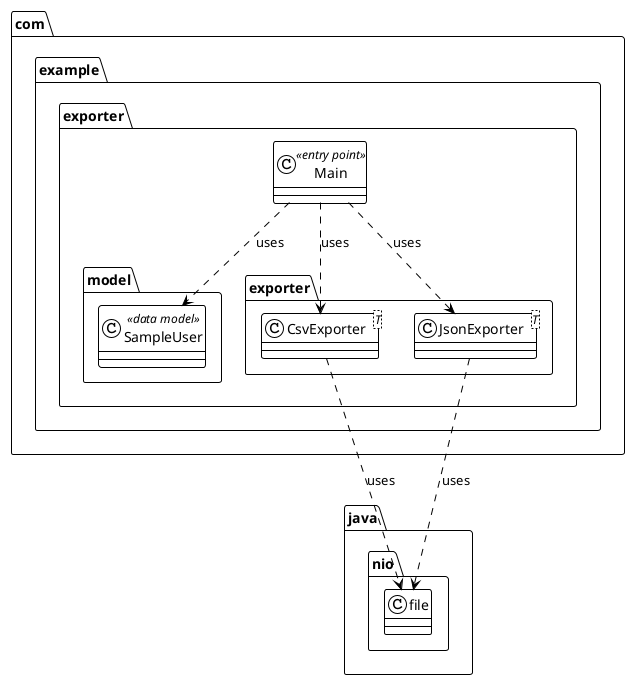
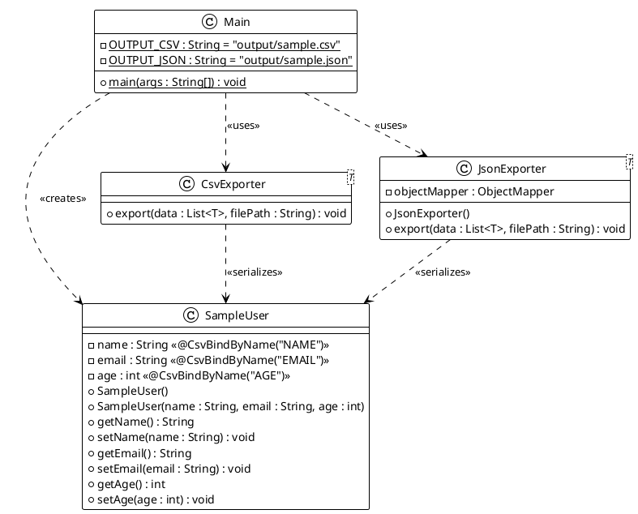
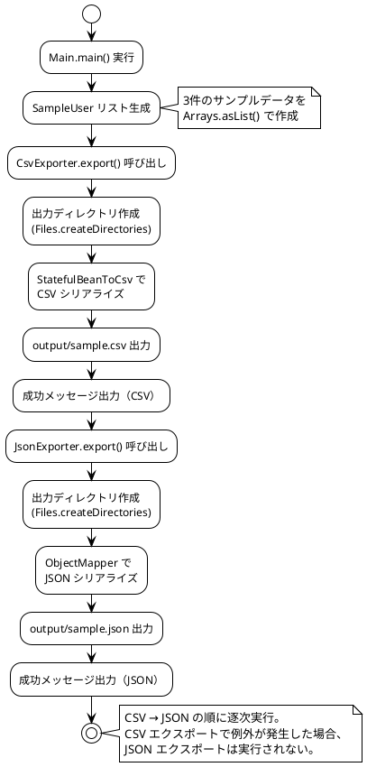

# 概要設計書

## 1. モジュール構成

### 1.1 パッケージ構成図

### 1.2 パッケージ一覧

| パッケージ | 責務 |
|-----------|------|
| `com.example.exporter` | アプリケーションエントリーポイント |
| `com.example.exporter.model` | データモデル定義 |
| `com.example.exporter.exporter` | ファイル出力処理 |

## 2. クラス図

## 3. データフロー

## 4. モジュール間インターフェース

### 4.1 エクスポーター共通インターフェース

現在、`CsvExporter` と `JsonExporter` は共通のインターフェースを実装していないが、同一のメソッドシグネチャを持つ。

| メソッド | シグネチャ | 説明 |
|---------|-----------|------|
| export | `void export(List<T> data, String filePath) throws Exception` | データリストを指定パスにファイル出力 |

**パラメータ仕様:**

| パラメータ | 型 | 制約 |
|-----------|-----|------|
| data | `List<T>` | null 不可、空リスト許容 |
| filePath | `String` | 有効なファイルパス、親ディレクトリは自動作成。**ディレクトリ部分を含む必要あり**（例: `output/file.csv`）。ファイル名のみ（例: `file.csv`）を指定すると `NullPointerException` が発生する |

**例外:**

| 例外 | 発生条件 |
|------|---------|
| `Exception` | ファイル書き込み失敗、シリアライズエラー |

### 4.2 依存関係マトリクス

| モジュール | 依存先 | 依存内容 |
|-----------|--------|---------|
| Main | model, exporter | データ生成、エクスポート実行 |
| CsvExporter | OpenCSV | Bean→CSV 変換 |
| JsonExporter | Jackson | オブジェクト→JSON 変換 |
| SampleUser | OpenCSV（アノテーション） | `@CsvBindByName` |

## 5. エラーハンドリング方針

### 5.1 基本方針

| 方針 | 内容 |
|------|------|
| 例外伝播 | エクスポーターは例外をスローし、呼び出し元で処理する |
| エラーメッセージ | `System.err.println` でユーザー向けメッセージを出力（※ログ導入後は Log4j2 に移行） |
| スタックトレース | 開発・デバッグ用に `printStackTrace()` を出力 |
| リカバリ | 現時点ではリトライ機構なし。エラー時は処理を中断 |

### 5.2 想定エラーと対処

| エラー | 発生箇所 | 対処 |
|--------|---------|------|
| `IOException` | ファイル書き込み | エラーメッセージ出力、処理中断 |
| `CsvDataTypeMismatchException` | CSV シリアライズ | 型不一致を通知、処理中断 |
| `JsonProcessingException` | JSON シリアライズ | シリアライズ不可を通知、処理中断 |
| `SecurityException` | ディレクトリ作成 | 権限不足を通知、処理中断 |
